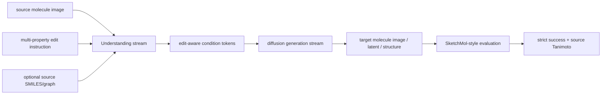

# 借鉴 3M-Diffusion 后的模型与训练方案

## 总体结构



这个结构和 3M-Diffusion 的共同点是 latent diffusion；区别是条件源不同：

```text
3M-Diffusion:
  molecule description -> text/graph aligned latent -> molecule generation

我们的方向:
  source molecule image + edit instruction -> edit-aware condition tokens
    -> target molecule generation
```

## Stage 1: molecule-language / molecule-image 对齐

目标是让 Understanding stream 先知道“分子图像/结构”和“语言描述/编辑语义”如何对应。

可用数据：

```text
3M-Diffusion ChEBI/PubChem 风格:
  molecule SMILES/rendered image + molecule description

我们的 edit dataset:
  source molecule image + instruction + target/source property metadata
```

建议训练目标：

```text
image/text contrastive loss
graph/text contrastive loss
source image -> source fingerprint/property auxiliary prediction
instruction -> active property / direction prediction
```

借鉴点来自 3M-Diffusion 的 graph-text contrastive pretraining：先把不同模态投到
同一个语义空间，再把这个空间交给生成模型。

## Stage 2: edit-aware condition token connector

输入：

```text
Qwen2.5-VL hidden states from:
  source molecule image
  natural-language edit instruction
```

输出：

```text
K 个 condition tokens, shape = [B, K, d]
```

监督信号：

```text
target property vector
property delta vector
active property mask
edit direction labels
target Morgan fingerprint
source-target Tanimoto bin
```

这一步要解决我们之前结果很弱的问题：如果 connector 只学 property delta，它很容易退化成
property retrieval；加入 target fingerprint 和 source-target similarity 后，它会被迫学习
“往哪里改”和“改完还要像 source”。

## Stage 3: conditioned latent diffusion

训练输入：

```text
target latent + edit-aware condition tokens
```

训练目标：

```text
pred_x0 或 pred_noise diffusion loss
optional property-consistency loss
optional source-similarity reward/rerank loss
```

可以借鉴 3M-Diffusion 的几个细节：

```text
EMA model for sampling
DDIM sampling for faster evaluation
classifier-free condition dropout
guidance weight at sampling time
latent normalization
```

## Ablation 设计

为了形成顶会级别的说服力，实验不要只给一个最终方法。建议至少做：

```text
text_only condition
source_image_only condition
source_image + instruction pooled feature
source_image + instruction query tokens
query tokens + target fingerprint loss
query tokens + target fingerprint + source similarity loss
```

评估表保持与 SketchMol 可比较：

```text
2p strict success
3p strict success
4p strict success
5p strict success
6p strict success
7p strict success
mean source Tanimoto
strict@Tanimoto>=0.4
strict@Tanimoto>=0.6
strict@Tanimoto>=0.8
validity
uniqueness
novelty
```

## 推荐实现顺序

1. 先做 unified condition dataset schema，不急着训练 diffusion。
2. 把 3M 风格 description rows 加成 Understanding pretraining 数据。
3. 把 current edit manifest 扩展成 query-token connector 训练数据。
4. 训练 connector，先在 retrieval benchmark 上看是否超过 pooled VLM。
5. 再接 diffusion generation stream，输出真正可比较的 generation 结果。

